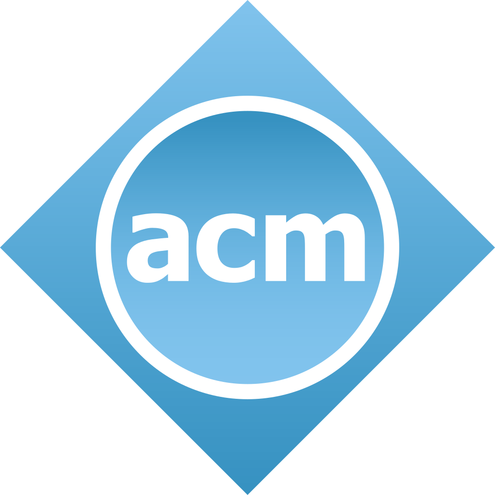
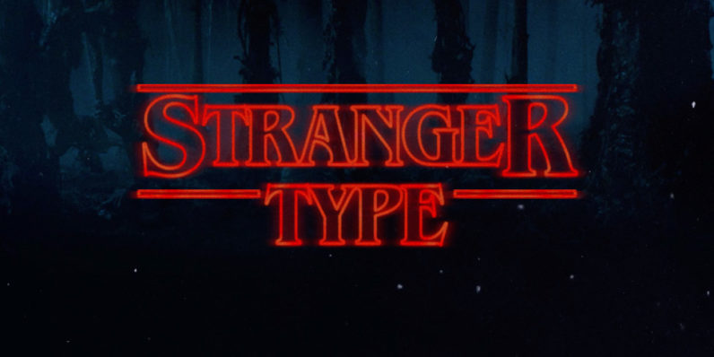

# Coding Bootcamp

This is the repository for the **Coding Bootcamp** programming workshop organized by [ACM](https://github.com/acmbpdc)

## Overview

This bootcamp is intended to provide the audience with a foundation in using some important tools in the industry.

## Sessions

| Session | Topic | Theme|
| :-----: |:-------------:| :-----:|
| 0 | [**Bootcamp Orientation**](sessions/00-bootcamp-orientation) |

|
| 1 | [**Introduction to Command Line**](sessions/01-introduction-to-command-line) |

|
| 2 & 3| **Basics of Python** [**Part 1**](sessions/02-basics-of-python) **&** [**Part 2**](sessions/03-basics-of-python) |

|
| 4 | [**Git Workshop**](sessions/04-git-workshop) |

|
| 5 | [**Competitive Programming**](sessions/05-competitive-programming) |

|
| 6 | [**Introductory Web Development**](sessions/06-introductory-web-development) |

|

## Evaluation

Navigate to [`evaluation`](./evaluation/) to find out more.

## Instructors

This workshop is conducted by :

*   [Kelvin DeCosta](https://github.com/kelvindecosta)
*   [Mohammed Shoaib](https://github.com/Mohammed-Shoaib)
