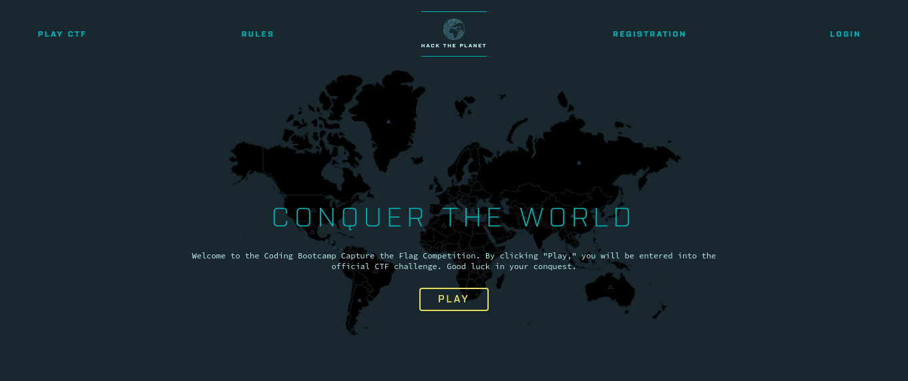

# Evaluation

This evaluation will be conducted in the form of a [CTF](https://ctfd.io/whats-a-ctf/).

## Syllabus

Part 1:

*   [Introduction to Command Line](../sessions/01-introduction-to-command-line)
*   Basics of Python [Part 1](../sessions/02-basics-of-python) + [Part 2](../sessions/03-basics-of-python)
*   [Git Workshop](../sessions/04-git-workshop)

_Part 2 (TBD)_

## Schedule

*   **4:00 pm - 4:15 pm** : _Briefing_
*   **4:15 pm - 5:15 pm** : _Evaluation_
*   **5:15 pm - 5:30 pm** : _Break_
*   **5:30 pm - 6:00 pm** : _Solutions_
 
## Register

*   Navigate to the [Coding Bootcamp CTF site](https://bit.ly/2onTwAS)
*   Provide the following details:
    *   Enter your full **name** as this will be printed on your certificates
    *   Enter your institute **email** address
    *   Enter your **team name**, a username that will be made visible to other participants
    *   Enter a **password** for authentication.
    *   Either choose one of the given images or upload your own **team logo**

>   Remember your access credentials for this site, since all evaluation components will be conducted here.

## Instructions

Navigate to the **Tutorial** once you are logged in.

Familiarize yourself with the following:

*   **Toolbars**
    *   **Leaderboard**
    *   **Announcements**
    *   **Activity**
    *   **Teams**
    *   **Filter**
*   **Game Clock**
*   **Captures**
*   **Scoreboard**

## Scoring

There are many highlighted locations on the map

Each location is home to a specific task

Your goal is to find a flag based on the description of the task.

>   Flags look like this `CTF{something_inside}`

Some tasks require you to work with some files which are included in an attachment.

>   In case you are working from within the telnet server, please clone this repository and access the attachments [here](#attachments)

Once you have found the flag, submit it to capture the location.

If you are stuck at a question, you can request for a hint.

Note that all hints have a penalty that reduces your score.

## Rules

*   You may use the internet for help
*   You must not cooperate with other participants

## Attachments

### [CTF 1](./ctf-01/fbctf-attachments-02-11-2019.tgz)

### _CTF 2 (TBD)_
