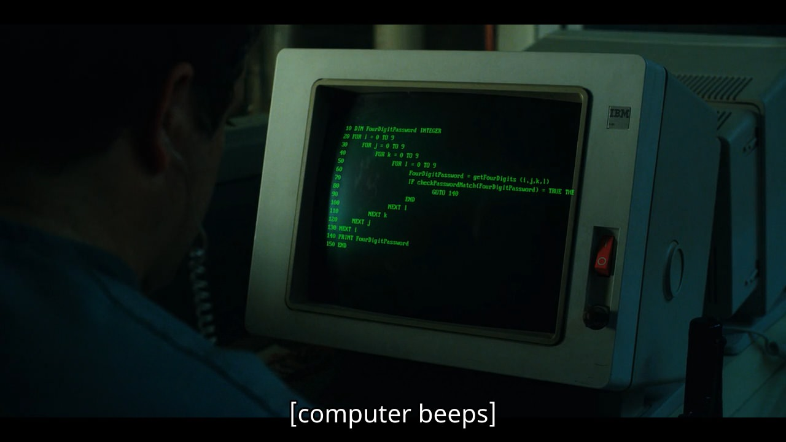

# Introduction to Command Line

A command line interface (CLI) is a way of interacting with a computer system where the user issues commands in the form of successive lines of text.

---

## Motivation

Fluency on the command line is a skill which although considered arcane, improves your productivity and flexibility as a computer engineer:

*   **Powerful Remotes**
    All major organizations use systems that are a lot more powerful than your average personal computer.


    These remote systems almost never use a graphical user interface (GUI) and *can be operated only with commands*.

*   **Workflow**
    Since command line is the *closest you can get to the operating system*, the use of direct commands improves your workflow.

*   **Enlightenment**
    Apart from its demand in the industry, command line expertise brings with it *a holistic idea about the operating system*.

*   **Control**
    It provides *fine-grained control over a system* and various methods to *automate boring tasks*.

Working on the command line interface is very similar to solving a simple puzzle. With the right approach, anything is possible. You just need to pick the right commands from a large toolbox.



---

## Environment

Over the course of this workshop, we will work in a [Linux](https://www.linux.org/) environment.

#### Connect

The workspaces are mounted on a Telnet server, at `172.16.22.5`

To connect to it:

*   **macOS, Linux**
    Open a terminal and run the following command:

    ```bash
    telnet 172.16.22.5
    ```

*   **Windows**:
    *   Ensure that the Telnet service is enabled by navigating to `Control Panel` > `Programs and Features` > `Turn Windows features on or off` > Check `Telnet Client`
    *   Hit `Windows` + `R` and enter the following command:
    
    ```powershell
    telnet 172.16.22.5
    ```

If you have followed the above instructions, you would have *successfully connected to the telnet server*.

Enter your credentials to access your workspace.

Once *successfully authenticated*, you should see the following prompt:

```
[username@linuxbpdc1 ~]$
```

This is where we input commands.


By default we are provided with a [Bash](https://www.gnu.org/software/bash/) terminal.

>   #### Bash
>   
>   When we input commands, the *bash interpreter* figures out what we are trying to do and requests the *operating system* to get it done.

---

## Basics

#### `echo`

Use the `echo` command to print stuff

```bash
echo "Hello, world."
```


```bash
echo 'Single quotes also work'
```

#### `printf`

You can also use the `printf` command to print according to a format

```bash
printf "Hello, %s!\n" "World"
```

>   #### Comment
>
>   Comments are like 'thoughts'
>   The interpreter ignores them.
>   They are there just for you.
>   So you know what you're doing.

Write single line comments with `#`

```bash
# Anything to the right of the # is ignored by the command line interface
```

#### `man`

The `man` command gives the manual for different commands

```bash
man echo # This gives a manual about "echo" . Press 'q' to exit
```

---

## System

#### `uname`

Whenever you enter a system for the first time, it is a good idea to learn more about it.

The `uname` command tells you which operating system is running.

```bash
uname
```

Use the `-a` flag to find out a lot more about the system.

```bash
uname -a
```

It shows you:

*   **hostname**: The name given to this system by the administrator
*   **kernel version**: The version of the backbone of the operating system
*   **date & timezone**
*   **system architecture**: This tells us whether the system uses 32 or 64 bit operations


>   #### Flag
>
>   A flag is nothing but an extra piece of information that you specify with the command. This provides additional functionality

#### `who`

There are many people logged in right now.


Use the `who` command to check them out.

```bash
who
```

Can't find yourself? Try *ONE* of the following:

*   ```bash
    who -m
    ```

*   ```bash
    who am i
    ```

---

## Navigation

When working with a GUI, we navigate across the filesystem using a file explorer:

*   File Explorer (Windows)
*   Finder (macOS)
*   Dolphin, Nautilus, Thunar and many others! (Linux)

#### `pwd`

Use the `pwd` command to find the present working directory

```bash
pwd # If you ever get lost,`pwd` will tell you exactly where you are
```

>   #### Directory
>
>   A folder. Simple.

​
You are currently in your `HOME` directory which is the equivalent of `Desktop` on PCs.

>   #### Path
>   
>   All files and directories on a computer system have a unique path that describes their location:
>   *   An **absolute path** refers to the same location in a file system relative to the *root >   directory*
>   *   A **relative path** points to a specific location in a file system relative to the *present working directory*
>   
>   Some important shorthand notations: 
>   
>   *   `.` refers to the `PWD`
>   *   `..` refers to the parent of `PWD`
>   *   `/` refers to the root directory
>   *   `~` refers to the `HOME` directory


#### `cd`

The `cd` command *changes* the `PWD` to a specified path

```bash
cd .. # Changes `PWD` to its parent. You can confirm this using `pwd`
```

#### `ls`

We can *list* the contents of a directory using `ls`

```bash
cd ../../.. # in this case, it takes you to the root directory
```

To return to your `HOME` directory, run *ONE* of the following:

You can format this output using flags

```bash
ls -l # formatted as a list
```

```bash
ls -al # displays all the contents (including hidden ones) in a list format
```

```bash
ls -h # sizes automatically adjusted to KB, MB, GB
```

You can chain `..` and switch to a directory that is an ancestor of the `PWD`

```bash
cd ../../.. # in this case , it takes you to the root directory
```

To return to your `HOME` directory, run *ONE* of the following:

*   ```bash
    cd # not specifying a path teleports you back home
    ```

*   ```bash
    cd $HOME # The $HOME variable stores the absolute path of your HOME directory
    ```

*   ```bash
    cd ~ # ~ = $HOME
    ```

Jump back to root and try all the above options.

```bash
cd / # jumps back to root, since "/" is the absolute path for root
```

---

## Data

#### `mkdir`

Once you are back `HOME`, create a directory using the `mkdir` command

```bash
mkdir strangers # creates a directory named 'strangers' in the `PWD`
```

Move into this new directory

```bash
cd strangers
```

#### `touch`

Use the `touch` command to create a file

```bash
touch description.txt # creates a file named 'description.txt'
```

>   #### File
>   Files store data
>
>   *   Files are stored in the computer's _secondary memory_
>   *   The file's data is stored in the form of _bytes_
>
>   For text files:
>
>   *   The bytes that represent this data take values in a _particular range_.
>   *   This range is determined by the _encoding_ used, which may be [ASCII](https://en.wikipedia.org/wiki/ASCII), [UTF-8](https://en.wikipedia.org/wiki/UTF-8) etc.
>   *   When being rendered, _specific characters_ that match the bytes of these files are shown.
>   *   Sometimes there are bytes that do not make sense so they don't get rendered properly.

Most systems have in-built text editors.
[Vim](https://www.vim.org/) (the sequel to [Vi](https://en.wikipedia.org/wiki/Vi)) and [Emacs](https://www.gnu.org/software/emacs/) are the best to use.
However, due to their *steep learning curves*, they are *not advisable for beginners*.

#### `nano`

Let us use the `nano` editor instead

```bash
nano description.txt # opens 'description.txt' with nano
```

Type something in.

```
When a young boy vanishes
a small town uncovers a mystery
involving secret experiments, terrifying supernatural forces
and one strange little girl.
```

>   #### Buffer
>   
>   The text that is shown are not the exact contents of the file. 
>   This data is held by the `nano` editor as a buffer and is residing in the RAM of the system.

To save the contents of the file:

*   Hit `Ctrl` + `X` to write the contents of the buffer into the file
*   Hit `Y` to confirm and `Enter`
*   `nano` now shows the name of the file it is about to write into. You can change this if you like. Hit `Enter` to finish.

#### `cat`

Use the `cat` command to display the contents of the file

```bash
cat description.txt
```

#### `head`

Use the `head` command to display the first few lines of the file

```bash
head description.txt -n 2 # prints the first 2 lines
```

#### `tail`

Similarly, you can display the last few lines with `tail`

```bash
tail description.txt -n 2 # prints the last 2 lines of the file
```

Create files with the following content:

*   `will.txt`
    ```
    Will is scared!
    ```

*   `demogorgon0.txt`
    ```
    This beast is hungry!
    ```

*   `el.txt`
    ```
    El is powerful!
    ```

*   `hopper.txt`
    ```
    Hopper is the best!
    ```

The workspace is very messy. Let us use directories to organize our files

Create 2 directories:

*   `hawkins`
*   `upsidedown`

#### `mv`

We can move files into specific directories using the `mv` command

Try one of the following commands to move `will.txt` into `upsidedown`:

*   ```bash
    mv will.txt upsidedown/ # 'will.txt' is moved into the directory 'upsidedown'
    ```

*   ```bash
    mv will.txt upsidedown/will.txt # renames 'will.txt' as 'upsidedown/will.txt' and hence moves it into 'upsidedown'
    ```

Similarly, move :

*   `el.txt` into `hawkins/`
*   `hopper.txt` into `hawkins/`
*   `demogorgon0.txt` into `upsidedown/`

Be very careful when using the `mv` command:

When `/` is not specified *at the end of the name of a directory*, it renames the source to the destination instead of moving it inside.

```bash
mv will.txt upsidedown # renames 'will.txt' to 'upsidedown'
```

In this case the the `upsidedown` directory is unchanged but `will.txt` is renamed to `upsidedown`

#### `tree`

To better visualize the contents of `PWD` use the `tree` command

```bash
tree # displays the names of files and directories in the PWD in a recursive manner
```


You can also use `-R` with `ls`

```bash
ls -R
```

#### `cp`

We can create copies of files using the `cp` command:

```bash
cp description.txt plot.txt # makes a copy of 'description.txt' and calls it 'plot.txt'
```

Check if the contents of the two files are the same.

Copy `demogorgon0.txt` multiple times

```bash
cp upsidedown/demogorgon0.txt upsidedown/demogorgon1.txt
cp upsidedown/demogorgon0.txt upsidedown/demogorgon2.txt
cp upsidedown/demogorgon0.txt upsidedown/demogorgon3.txt
cp upsidedown/demogorgon0.txt upsidedown/demogorgon4.txt
```

We can scale these operations to affect multiple files 

Let's bring `will.txt` and the `demogorogon0.txt` copies from the `upsidedown` to `hawkins`

```bash
mv upsidedown/*.txt hawkins/
```

#### `rm`

Those `demogorgons` are annoying. Let's kill them all!

Use the `rm` command to delete files

```bash
rm demogorgon0.txt
```

Scale this command to delete all of them

```bash
rm demogorgon*.txt
```

You got rid of them from `hawkins`.
The `upsidedown` is still bothering you.

#### `rmdir`

Use the `rmdir` command to delete directories.

You can destroy the `upsidedown` in *ONE* of the following ways:

*   ```bash
    rmdir upsidedown
    ```
*   ```bash
    rm -rf upsidedown # -r specifies recursion, -f specifies force. Deletes a directory recursively
    ```

Give yourself a pat on the back. You saved `hawkins`

---

## Privacy

#### `passwd`

Right now, there isn't anything important on your system.
It is still a good idea to update your login credentials.

Use the `passwd` command to do so.

View the details of the contents in the `PWD`

```bash
ls -al
```

You should see the following characters next to each entity in the directory

```
-rwxr-xr-x
```

These characters represent the permissions for a particular entity.

>   #### Permission
>
>   *Everything* on such systems has *permissions* attached to it.
>   Since files, directories & programs all have permissions of their own, there is a very elaborate permission mechanism.
>
>   *   The first character describes the type of entity
>       *   ***-*** for a **regular** file
>       *   ***d*** for **directory**
>       *   ***c*** for **charcater** special file
>       *   ***b*** for **block** special file
>       *   ***l*** for symbolic **links** 
>       
>       You can learn more [here](https://en.wikipedia.org/wiki/Unix_file_types)
>
>   *   The next 9 characters are in fact 3 groups of characters that represent permissions for different users
>       *   The *first 3* show the permissions for the **owner** of the file
>       *   The *second 3* show the permissions for the **group** associated with that file
>       *   The *last 3* show the permissions for the **rest** of the users
>
>   *   Each group of 3 characters represents the 3 major permissions
>       *   ***r*** for **read** and is equivalent to *4*
>       *   ***w*** for **write** and is equivalent to *2*
>       *   ***x*** for **execute** and is equivalent to *1*
>
>   A permission of *5* allows only *read* and *execute* (4 + 1 = 5).


File permissions can be changed by:

*   The owner
*   `root` i.e. any superuser

#### `chmod`

Use the `chmod` command to change permissions

```bash
chmod 777 hawkins # allows anyone (owner, group and rest) to do anything (read, write and execute) to 'hawkins'
```

#### `chown`

The `chown` command can be used to change the ownership of a file but can only be called by `root`

---

## Miscellaneous

#### `wc`

Use the `wc` command to count display:

*   The number of lines
*   The number of words
*   The number of characters

```bash
wc plot.txt
```

You can use flags to limit the output to what you need

```bash
wc plot.txt -l # shows the number of lines for 'plot.txt'
```

#### `grep`

Use the `grep` command to search for specific characters in a file

```bash
grep "a" plot.txt # shows the occurrences of 'a' in 'plot.txt'
```

An important feature of Bash is the pipe system

>   #### Pipe
>
>   It enables the output of one command to be used as the input for another.

You can combine `grep` and `wc` to combine their functionalities

```bash
grep "a" plot.txt | wc -c # shows the number of occurrences of 'a' in 'plot.txt'
```

#### `history`

Use the `history` command to show your command history

```bash
history
```

You can combine `grep` and `history` to search for a particular command

```
history | grep "cd"
```

#### `ps`

Use the `ps` command to look at processes that are running on the system

```bash
ps  # shows you what you are running
```

Look at all processes

```bash
ps aux
```

This is a lot. Let us save it into a file

>   #### Redirection
>
>   Redirections are very similar to pipes except that they work on files

```bash
ps aux > processes.txt
```

---

## Summary

We covered:

*   [Motivation](#motivation)
*   [Environment](#environment)
    *   [Connect](#connect)
    *   [Bash](#bash)
*   [Basics](#basics)
    *   [`echo`](#echo)
    *   [`printf`](#printf)
    *   [Comment](#comment)
    *   [`man`](#man)
*   [System](#system)
    *   [`uname`](#uname)
    *   [Flag](#flag)
    *   [`who`](#who)
*   [Navigation](#navigation)
    *   [`pwd`](#pwd)
    *   [Directory](#directory)
    *   [Path](#path)
    *   [`cd`](#cd)
    *   [`ls`](#ls)
*   [Data](#data)
    *   [`mkdir`](#mkdir)
    *   [`touch`](#touch)
    *   [File](#file)
    *   [`nano`](#nano)
    *   [Buffer](#buffer)
    *   [`cat`](#cat)
    *   [`head`](#head)
    *   [`tail`](#tail)
    *   [`mv`](#mv)
    *   [`tree`](#tree)
    *   [`cp`](#cp)
    *   [`rm`](#rm)
    *   [`rmdir`](#rmdir)
*   [Privacy](#privacy)
    *   [`passwd`](#passwd)
    *   [Permission](#permission)
    *   [`chmod`](#chmod)
    *   [`chown`](#chown)
*   [Miscellaneous](#miscellaneous)
    *   [`wc`](#wc)
    *   [`grep`](#grep)
    *   [Pipe](#pipe)
    *   [`history`](#history)
    *   [`ps`](#ps)
    *   [Redirection](#redirection)
