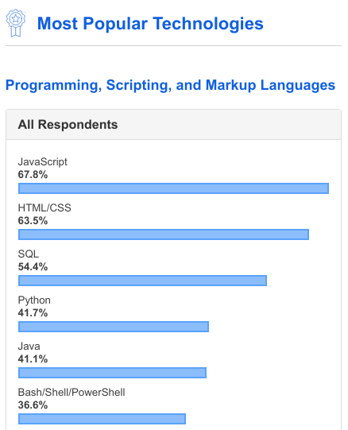

# Basics Of Python

<p align="center"></p>

# Motivation

Python is a high-level, interpreted, scripting language developed in the late 1980s by Guido van Rossum. Python is designed to be highly readable. Why choose python you may ask considering there are dozens of languages out there, here's why:

*	Python is **popular**

	Python has grown in popularity in the last decade. The 2019 stack overflow developer survey ranks Python as the **4<sup>th</sup>** most popular language.

	

*	Python is **interpreted**

	Many languages are compiled, meaning the source code needs to be translated into a language your computer understands before it can be run. An interpreter skips this intermediate step and runs the program directly allowing a quicker development cycle. However, this can be a downside in some cases as interpreted languages tend to be slower.

*	Python is **portable**

	Since python is interpreted, code written for one platform will work on any other platform which has the interpreter installed.

*	Python is highly **readable**

	The code is simple, the syntax is easy to grasp and _very_ readable. Additionally, it supports highly complex tasks which would otherwise be difficult to implement.

---

# Basics

## Python Interpreter

The python interpreter takes the code you write and converts it into a language that the computer understands. It does this each time you run a python script. There are 2 versions, python 2 & python 3. However, from January 1, 2020 python 2 will no longer be maintained. From now onwards, the term _python_ refers to python 3.

Launch a terminal to get started

*	In Windows, it is called the **Command Prompt**.
*	In macOS or Linux, it is called the **Terminal**.

Open up the python interpreter by typing the following in the terminal

```bash
$ python3
```

You should see something like this

```bash
Python 3.7.4 (default, Oct  4 2019, 06:57:26) 
[GCC 9.2.0] on linux
Type "help", "copyright", "credits" or "license" for more information.
>>> 
```

Make sure you have Python 3 installed, as you can see above we have Python **3**.x. If you still have issues, you can use this [online](https://repl.it) interpreter.

You have now launched python in an interactive **REPL** environment

*	**R**eads the command you enter
*	**E**valuates and executes the command
*	**P**rints the output (if any) to the console
*	**L**oops back and repeats the process

Let's run our first command!

```python
>>> print("Hello, World!")
Hello, World!
```

---

## Comments

Write single-line comments with `#`

```python
>>> # This is ignored by the python interpreter
```

Unfortunately, Python does not have a way to write multiline comments. However, you can still create multiline comments in 3 ways:

1.	```python
	>>> # This is a multiline comment
	... # using the hash symbol
	```

2.	```python
	>>> """
	... This is a multiline comment
	... using triple double quotes
	... """
	'\nThis is a multiline comment\nusing triple double quotes\n'
	```

3.	```python
	>>> '''
	... This is a multiline comment
	... using triple single quotes
	... '''
	'\nThis is a multiline comment\nusing triple single quotes\n'
	```

Ways 2 & 3 give you multiline functionality, but this isn't technically a comment. Be careful when you use these multiline _comments_, and when in doubt, just put the `#` on each subsequent line.

---

# Data Types

## Variables

Variables are nothing but reserved memory locations to store values. You can imagine them as a bucket to hold your information. You use the `=` operator to assign values to variables

```python
>>> a = 10
>>> b = 20
>>> print(a)
10
>>> b
20
```

Python also allows you to assign values to multiple variables simultaneously

```python
>>> a, b = 10, 20
```

---

## Numbers

You have already seen a few numbers. Number data types store numeric values. Python supports 3 different numerical types

```python
>>> a = -10			# int
>>> b = 3.14159			# float
>>> c = -2.2 + 5.3j		# complex
```

An **integer** is a whole number that can be positive, negative or zero.

A **floating point** number contains one fractional part after the decimal point.

A **complex** number is any number that can be written as _a + bi_, where _i_ is the imaginary unit and _a_ & _b_ are real numbers.

In python, there is no limit to how long an `int` value can be

```python
>>> 12121212121212121212121212121212121212121212121212121212121212121212121 + 1
12121212121212121212121212121212121212121212121212121212121212121212122
```

---

## Boolean

Boolean type may have one of two values, `True` or `False`.

```python
>>> a = True	# bool
>>> b = False	# bool
```

> The following elements are false:
> *	`False`
> *	`None`
> *	_0_ (whatever type i.e, `int`, `float` or `complex`)
> *	Empty collections: `""`, `()`, `[]`, `{}`
> * Objects from classes that have the special method `__nonzero__`
> *	Objects from classes that implements `__len__` to return `False` or _0_
>
> All values besides these are considered `True` in Python.

---

## Strings

A string is a sequence of characters.

```python
>>> str1 = "I like cats."	# str enclosed in double quotes
>>> str2 = 'I like dogs.'	# str enclosed in single quotes
```

When using quotes in strings, they need to be escaped using the `\` operator

```python
>>> str1 = 'I\'ll have what he is having.'
>>> str2 = "\"To be or not to be\" - William Shakespeare"
```

If you only need to use one type of quotes in your string, you can enclose the string in alternative quotes

```python
>>> str1 = "I'll have what he is having."		# string with single quotes enclosed in double quotes
>>> str2 = '"To be or not be" - William Shakespeare'	# string with double quotes enclosed in single quotes
```

If you do not want characters prefaced by `\` to be interpreted as special characters, you can use _raw strings_ by adding an `r`

```bash
>>> print('C:\some\name')
C:\some
ame
>>> print(r'C:\some\name')
C:\some\name
```

---

# Operators

## Arithmetic Operators

Arithmetic operators are used with numeric values to perform common mathematical operations. The most basic of them are the unary operators

```python
>>> a = 5
>>> b = 3
>>> +a		# unary addition
5
>>> -b		# unary subtraction
-3
```

Generally, you'll be using binary operators

```python
>>> 2 + 2	# addition
4
>>> 8 - 5	# subtraction
3
>>> 3 * 5	# multiplication
15
>>> 8 / 2	# division
4.0
```

The numbers 4, 5 and 15 are of type `int`, i.e, integer. The number 4.0 has a fractional part and is of type `float`.

By default, the division `/` returns a `float`. To get an integer result (discard fractional part) called **floor division**, you can use the `//` operator

```python
>>> 11 / 4	# floating point division
2.75
>>> 11 // 4	# floor division
2
```

If both operands of `//` are integers, only then the result is of type `int`. Otherwise, the result is of type `float`.

```python
>>> 10 // 3		# int // int => int
3
>>> 10.0 // 3		# float // int => float
3.0
>>> 10 // 3.0		# int // float => float
3.0
>>> 10.0 // 3.0		# float // float => float
3.0
```

There are 2 more arithmetic operators

```python
>>> 5**2	# exponentiation, 5 squared
25
>>> 10 % 3	# modulus, returns remainder of division
1
```

---

## Comparison Operators

Comparison operators compare values on either sides, these are also called **relational** operators.

```python
>>> 5 == 5	# (a == b) returns True if a is equal to b else False
True
>>> 5 != 5	# (a != b) returns True if a is not equal to b else False
False
>>> 2 < 3	# (a < b) returns True if a is strictly less than b else False
True
>>> 2 > 3	# (a > b) returns True if a is strictly greater than b else False
False
>>> 7 >= 7	# (a >= b) returns True if a is greater than or equal to b else False
True
>>> 7 <= 4	# (a <= b) returns True if a is less than or equal to b else False
False
```

---

## Assignment Operators

An assignment operator assigns a value to its left operand based on the value of its right operand. The basic assignment operator is equal `=` which assigns the value of its right operand to its left operand. The other assignment operators are shorthand for standard operations.

```python
>>> num  = 8	# a = b		num = 8
>>> num += 3	# a = a + b	num = 11
>>> num -= 5	# a = a - b	num = 6
>>> num *= 6	# a = a * b	num = 36
>>> num /= 5	# a = a / b	num = 7.2
>>> num//= 3	# a = a // b	num = 2.0
>>> num**= 3	# a = a ** b	num = 8.0
>>> num %= 5	# a = a % b	num = 3.0
```

---

## Logical Operators

Logical operators are used to combine conditional statements.

```python
>>> a = True
>>> b = False
>>> a and b	# returns True if both the operands are True
False
>>> a or b	# returns True if either of the operand is True
True
>>> not a	# returns True if operand is False
False
```

There are more types of operators, but for now these will suffice. You can read up about them [here](https://realpython.com/python-operators-expressions/).

---

# Control Flow

## if Statement

`if` statements are used for decision making. It will run the body of code only `if` the condition is true. It has the following syntax

```python
if <expression>:
	<statement>
```

> Note the use of colon `:` after the `<expression>`.

_If_ `<expression>` is true, then `<statement>` is executed. _If_ `<expression>` is false, then `<statement>` is skipped over and _not_ executed.


```python
>>> raining = True
>>> if raining:		# the condition is True
...     print("Stay at home")
... 
Stay at home
```

Say you _also_ want to execute a block of code `if` the condition is not true, here comes `else` to the rescue

```python
>>> raining = False
>>> if raining:		# the condition is False
...     print("Stay at home")
... else:
...     print("Let's go outside")
... 
Let's go outside
```

If you have multiple separate conditions, use `elif`

```python
>>> age = 21
>>> if age < 4:		# False
...     print("Join nursery")
... elif age < 18:	# False
...     print("Stay in school")
... elif age < 24:	# True!
...     print("Work hard in university")
... elif age < 60:	# skips
...     print("Get working")
... else:			# skips
...     print("Time to retire")
... 
Work hard in university
```

> There can be 0 or more `elif` parts and the `else` part is optional. 
>
> The keyword `elif` is short for _else if_. 
>
> At most, one of the code blocks will be executed. If an `else` clause isn't included, and all the conditions are `False`, then none of the blocks will be executed.

Python also has the conditional expression (also known as a ternary operator) which has the following syntax

```python
A if condition else B
```

Often you can use the conditional expression to make your `if` statement concise

```python
>>> raining = True
>>> "Stay at home" if raining else "Let's go outside"
'Stay at home'
```

---

## while Loop

Loops execute a block of code number of times as long as a condition is met. The most basic example is the `while` loop

```python
>>> i = 0
>>> while i < 5:	# loop over numbers from 0 through 4
...     print(i)
...     i += 1
... 
0
1
2
3
4
```

If you want to exit your loop in case a certain condition is met, you can use `break`

```python
>>> i = 0
>>> while i < 5:
...     if i == 3:	# breaks the loop when i = 3
...         break
...     print(i)
...     i += 1
... 
0
1
2
```

If you don't want to exit the loop but want to skip the code block execution in case a certain condition is met, you can use `continue`

```python
>>> i = 0
>>> while i < 5:
...     if i == 3:	# skips the rest of the code block when i = 3
...			i += 1	# causes an infinite loop otherwise!
...         continue
...     print(i)
...     i += 1
... 
0
1
2
4
```

---

## for Loop

The `for` loop iterates over the items of any sequence in the order they appear. Unlike the `while` loop which depends on a condition being met, `for` loop depends on the elements it has to iterate.

```python
>>> for c in "python":	# loop over a sequence of elements
...     print(c)
... 
p
y
t
h
o
n
```

To loop over numbers, use the `range` function

```python
>>> for i in range(5):	# loop over numbers from 0 through 4
...     print(i)
... 
0
1
2
3
4
```

The `range` function generates a sequence of numbers over time. The sytax of a `range` function is as follows

```python
range([start,] end [,step])
```

*	start (_optional_) Starting point of the sequence, defaults to **0**
*	stop (required) Endpoint of the sequence, **non-inclusive**
*	step (_optional_) Step size of the sequence, defaults to **1**

```python
>>> for i in range(1, 10, 2):	# loop over numbers from 0 through 9 picking every 2nd value
...     print(i)
... 
1
3
5
7
9
```

---

# Iterables

## Lists

A `list` is a collection of arbitrary objects, similar to arrays in other programming languages. A `list` is defined by enclosing a comma-separated sequence of objects in square brackets `[]`

```python
>>> squares = [1, 4, 9, 16, 25]	# list of numbers
>>> names 	= ['rahul', 'mary', 'abdul', 'harshita'] # list of strings
>>> variety = [3, 'jacob', 2.718, True, [9, 8, 7]] # list of varying data types
```

One useful function is getting the length of a `list`

```python
>>> squares = [1, 4, 9, 16, 25]
>>> len(squares)	# returns the number of elements in the list
5
```

To understand accessing elements of a `list`, it is very important to understand the concept of slicing.


```python
>>> my_list = [0, 1, 2, 3, 4, 5, 6, 7, 8, 9]
>>> #          0, 1, 2, 3, 4, 5, 6, 7, 8, 9
... #        -10,-9,-8,-7,-6,-5,-4,-3,-2,-1
```

In python, you can use both +ve and -ve indices to access elements

```python
>>> my_list[0]		# 1st element from the front
0
>>> my_list[5]		# 5th element from the front
5
>>> my_list[9]		# 9th element from the front
9
>>> my_list[-1]		# 1st element from the back
9
>>> my_list[-5]		# 5th element from the back
5
>>> my_list[-10]	# 10th element from the back
0
```

But say you want to get a `range` of elements, we use the following syntax

```python
list[start:end:step]
```

*	start - Starting position of `range`, defaults to **0**
*	end - Ending position of `range`, **non-inclusive**, defaults to **length** of `list`
*	step - Step size, defaults to **1**

```python
>>> my_list[0:5]	# 1st element from the front till the 4th element from the front
[0, 1, 2, 3, 4]
>>> my_list[3:8]	# 3rd element from the front till the 7th element from the front
[3, 4, 5, 6, 7]
>>> my_list[0:-5]	# 1st element from the front till the 6th element from the back
[0, 1, 2, 3, 4]
>>> my_list[-7:-2]	# 7th element from the back till the 3rd element from the back
[3, 4, 5, 6, 7]
```

Since end is non-inclusive, how do you get till the end of a `list`?

```python
>>> my_list[1:9]		# Does not work
[1, 2, 3, 4, 5, 6, 7, 8]
>>> my_list[1:10]		# Bad
[1, 2, 3, 4, 5, 6, 7, 8, 9]
>>> my_list[1:len(my_list)]	# Okay
[1, 2, 3, 4, 5, 6, 7, 8, 9]
>>> my_list[1:]			# Good
[1, 2, 3, 4, 5, 6, 7, 8, 9]
```

This also works for the beginning

```python
>>> my_list[0:-1]		# Okay
[0, 1, 2, 3, 4, 5, 6, 7, 8]
>>> my_list[:-1]		# Good
[0, 1, 2, 3, 4, 5, 6, 7, 8]
```

You can also drop both start and end to get the entire `list`

```python
>>> my_list[:]	# The entire range
[0, 1, 2, 3, 4, 5, 6, 7, 8, 9]
```

We haven't touched the step parameter. The step allows to skip values

```python
>>> my_list[2:9:1]	# the default value of step, pick every 1st element
[2, 3, 4, 5, 6, 7, 8]
>>> my_list[2:9:2]	# pick every 2nd element
[2, 4, 6, 8]
```

The value of step can also be -ve which will run in reverse

```python
>>> my_list[8:1:-1]	# pick every 1st element in reverse
[8, 7, 6, 5, 4, 3, 2]
>>> my_list[8:1:-2]	# pick every 2nd element in reverse
[8, 6, 4, 2]
```

Using step you can reverse the entire `list`

```python
>>> my_list[::-1]	# get the entire list and pick every 1st element in reverse
[9, 8, 7, 6, 5, 4, 3, 2, 1, 0]
```

Now that you have an understanding of `list`, let's now see some built-in functions

The `in` and `not in` operators

```python
>>> my_list
[0, 1, 2, 3, 4, 5, 6, 7, 8, 9]
>>> 5 in my_list	# checks if 5 is in my_list
True
>>> 10 not in my_list	# checks if 10 is not in my_list
True
```

You can concatenate two `list` objects by using the `+` operator

```python
>>> [0, 1, 2] + [3, 4, 5] # concatenates the 2 lists
[0, 1, 2, 3, 4, 5]
```

You can repeat a `list` by using the `*` operator

```python
>>> [0, 1, 2] * 3	# repeats list [0, 1, 2] 3 times and concatenates
[0, 1, 2, 0, 1, 2, 0, 1, 2]
```

You can also use mathematical functions

```python
>>> my_list
[0, 1, 2, 3, 4, 5, 6, 7, 8, 9]
>>> min(my_list)	# returns the minimum or smallest element in the list
0
>>> max(my_list)	# returns the maximum or largest element in the list
9
>>> sum(my_list)	# returns the sum of elements in the list
45
```

Keep in mind that a `list` can also be nested

```python
>>> l = [[0, 1, 2], ['zainab', 'rahul', 'james']] # l comprises of 2 nested lists
>>> l[0][2]	# l[0] = [0, 1, 2]
2
>>> l[1][:2]	# l[1] = ['zainab', 'rahul', 'james']
['zainab', 'rahul']
>>> l[0][::-1]
[2, 1, 0]
```

One fundamental concept of `list` is that it is mutable. This means you can change values in a `list`, elements can be added, deleted, shifted and moved around at will.

> A **mutable** object can be modified after it is created. In contrast, an **immutable** object is one whose state cannot be modified after it is created.

We will use the following example

```python
>>> dogs = ['pug', 'beagle', 'poodle', 'shiba inu', 'chow chow']
```

To modify a single value

```python
>>> dogs[1] = 'bulldog'	# modify element at position 1
>>> dogs
['pug', 'bulldog', 'poodle', 'shiba inu', 'chow chow']
```

Or modify a `range` of values

```python
>>> dogs[:3] = ['retriever', 'husky', 'terrier'] # modify all elements in range(0, 3)
>>> dogs
['retriever', 'husky', 'terrier', 'shiba inu', 'chow chow']
```

You can `append` elements at end of a `list`

```python
>>> dogs.append('boxer') # add 'boxer' at end of the list
>>> dogs
['retriever', 'husky', 'terrier', 'shiba inu', 'chow chow', 'boxer']
```

Or `insert` at a specific index

```python
>>> dogs.insert(2, 'papillon')	# insert 'papillion' at position 2
>>> dogs
['retriever', 'husky', 'papillon', 'terrier', 'shiba inu', 'chow chow', 'boxer']
>>> dogs.insert(-1, 'maltese')	# negative indices also work
>>> dogs
['retriever', 'husky', 'papillon', 'terrier', 'shiba inu', 'chow chow', 'maltese', 'boxer']
```

To delete a single value

```python
>>> del dogs[2]		# delete element at position 2
>>> dogs
['retriever', 'husky', 'terrier', 'shiba inu', 'chow chow', 'maltese', 'boxer']
>>> del dogs[-2]	# negative indices also work
>>> dogs
['retriever', 'husky', 'terrier', 'shiba inu', 'chow chow', 'boxer']
```

Or delete a `range` of values

```python
>>> del dogs[:3]	# delete all elements in the range(0, 3)
>>> dogs
['shiba inu', 'chow chow', 'boxer']
```

One neat property of a `list` is unpacking

```python
>>> student = ['Neha', 19, 2019]	# list packing
>>> name, age, year = student		# list unpacking
>>> print(name, age, year)		# prints as space separated values by default
Neha 19 2019
```

However, if we try to unpack more/less values than expected, python throws an error
```python
>>> student = ['Neha', 19, 2019]
>>> name, age, year, id_no = student	# trying to unpack 4 values from a list of 3 values
Traceback (most recent call last):
  File "<stdin>", line 1, in <module>
ValueError: not enough values to unpack (expected 4, got 3)
```

You can convert an `str` object or a string to a `list` using type casting 

```python
>>> list("python")	# breaks the string into a list of characters
['p', 'y', 't', 'h', 'o', 'n']
```

> Type casting or type coercion refers to converting one data type into another.

We can use type casting to better understand the `range` function

```python
>>> list(range(5))		# returns a list of elements from 0 to 4
[0, 1, 2, 3, 4]
>>> list(range(1, 10, 2))	# returns a list of odd elements from 1 to 9
[1, 3, 5, 7, 9]
```

To iterate over a `list`

```python
>>> animals = ['lion', 'cat', 'panda', 'dog']
>>> for animal in animals:	# loops through a sequence of elements
...     print(animal)
... 
lion
cat
panda
dog
```

---

## Tuples

A `tuple` is identical to a `list` in all respects, except for the following properties:

*	A `tuple` is defined using parenthesis `()` instead of square brackets `[]` as in a `list`
*	A `tuple` is immutable

Why use a `tuple` over `list`?

*	Faster execution
*	Data remains constant

```python
>>> my_tuple = (0, 1, 2, 3, 4, 5, 6, 7, 8, 9)
>>> my_tuple[5]
5
>>> my_tuple[-3]
7
>>> my_tuple[:5]
(0, 1, 2, 3, 4)
>>> my_tuple[1:]
(1, 2, 3, 4, 5, 6, 7, 8, 9)
>>> my_tuple[2:9:2]
(2, 4, 6, 8)
>>> my_tuple[::-1]
(9, 8, 7, 6, 5, 4, 3, 2, 1, 0)
```

Since they are immutable, you _cannot_ change their values

```python
>>> my_tuple[0] = 10		# error
Traceback (most recent call last):
  File "<stdin>", line 1, in <module>
TypeError: 'tuple' object does not support item assignment
```

To iterate over a `tuple`

```python
>>> levels = ('preschool', 'elementary', 'intermediate', 'senior high', 'university')
>>> for level in levels:	# loops through a sequence of elements
...     print(level)
... 
preschool
elementary
intermediate
senior high
university
```

We can now try to see `enumerate` function

```python
>>> tuple(enumerate(levels))	# adds a counter for each value as a tuple of (counter, value)
((0, 'preschool'), (1, 'elementary'), (2, 'intermediate'), (3, 'senior high'), (4, 'university'))
```

The default starting value for the counter is **0** in `enumerate`. However, you can specify a different starting value

```python
>>> tuple(enumerate(levels, 100))	# starts the counter from 100
((100, 'preschool'), (101, 'elementary'), (102, 'intermediate'), (103, 'senior high'), (104, 'university'))
```

Using `tuple` unpacking we can loop through with `enumerate`

```python
>>> levels = ('preschool', 'elementary', 'intermediate', 'senior high', 'university')
>>> for index, level in enumerate(levels):	# loop through a sequence of elements with tuple unpacking
...     print(index, level)
... 
0 preschool
1 elementary
2 intermediate
3 senior high
4 university
```

---

## Dictionaries

A dictionary is a collection of key-value pairs. The key is a _unique_ identifier that is mapped to a value, almost like a real-world dictionary where each word is a key and the definition is the value. You can define a dictionary using curly braces `{}`, a colon `:` separates each key from its value

```python
>>> student = {'name': 'Rahul', 'age': 21, 'courses': ['CS', 'Chem', 'TRW', 'Bio']}	# dict
```

We access values of a `dict` similar to a `list` but instead of specifying the position (which doesn't make much sense in a dictionary), we specify the key

```python
>>> student['name']		# accessing the key 'name'
'Caleb'
>>> student['age']		# accessing the key 'age'
25
>>> student['courses']	# accessing the key 'courses'
['CS', 'Chem', 'TRW', 'Bio']
```

If the key, does not exist it will throw an error, a better way is to use the `get` method

```python
>>> student['idno']		# error
Traceback (most recent call last):
  File "<stdin>", line 1, in <module>
KeyError: 'idno'
>>> print(student.get('idno'))	# returns None if key does not exist
None
```

Adding an entry is as easy as assigning a new key and a value

```python
>>> student['idno'] = '2019A7PS0903U'	# updates the value if key exists else creates a new key with value
>>> student
{'name': 'Caleb', 'age': 25, 'courses': ['CS', 'Chem', 'TRW', 'Bio'], 'idno': '2019A7PS0903U'}
```

To delete an entry

```python
>>> del student['idno']	# delete key-value pair with key 'idno'
>>> student
{'name': 'Caleb', 'age': 25, 'courses': ['CS', 'Chem', 'TRW', 'Bio']}
```

We can have a variety of keys and values just like in a `list` or `tuple` as long as the _keys_ are of immutable data type

```python
>>> variety = {13: 'prime', 'constants': [3.14, 2.718, 1.618], (1 + 4.2j): True}	# dict of varying data types
```

Let's now look at some built-in methods. We'll use the following example

```python
>>> letters = {0: 'a', 1: 'b', 2: 'c', 3: 'd', 4: 'e'}
```

Some common methods

```python
>>> letters.items()	# returns the key-value pairs of dict
dict_items([(0, 'a'), (1, 'b'), (2, 'c'), (3, 'd'), (4, 'e')])
>>> letters.keys()	# returns the keys of dict
dict_keys([0, 1, 2, 3, 4])
>>> letters.values()	# returns the values of dict
dict_values(['a', 'b', 'c', 'd', 'e'])
```

Using the `items` method and `tuple` unpacking, we can loop through a `dict`

```python
>>> letters = {0: 'a', 1: 'b', 2: 'c', 3: 'd', 4: 'e'}
>>> for key, value in letters.items():	# loop through a sequence of elements with tuple unpacking
...     print(key, value)
... 
0 a
1 b
2 c
3 d
4 e
```

To merge a dictionary using another dictionary

```python
>>> letters.update({5: 'f', 6: 'g', 7: 'h'})	# updates the value if key present else creates a new one
>>> letters
{0: 'a', 1: 'b', 2: 'c', 3: 'd', 4: 'e', 5: 'f', 6: 'g', 7: 'h'}
```

To empty a `dict`

```python
>>> letters.clear()	# delete all key-value pairs in dict
>>> letters
{}
```

---

# Summary

We covered:

*	[Motivation](#motivation)
*	[Basics](#basics)
	*	[Python Interpreter](#python-interpreter)
	*	[Comments](#comments)
*	[Data Types](#data-types)
	*	[Variables](#variables)
	*	[Numbers](#numbers)
	*	[Boolean](#boolean)
	*	[Strings](#strings)
*	[Operators](#operators)
	*	[Arithmetic Operators](#arithmetic-operators)
	*	[Comparison Operators](#comparison-operators)
	*	[Assignment Operators](#assignment-operators)
	*	[Logical Operators](#logical-operators)
*	[Control Flow](#control-flow)
	*	[if Statement](#if-statement)
	*	[while Loop](#while-loop)
	*	[for Loop](#for-loop)
*	[Iterables](#iterables)
	*	[Lists](#lists)
	*	[Tuples](#tuples)
	*	[Dictionaries](#dictionaries)