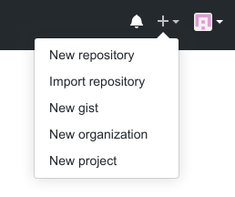
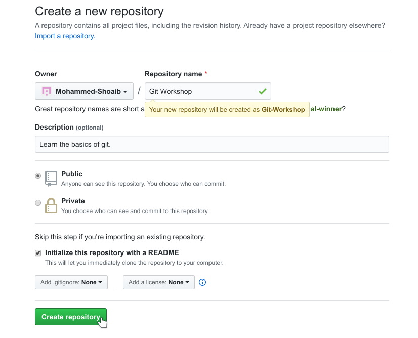

<h1>  Git Workshop

<p align="center"></p>

# Motivation

**What is Version Control?**

Version control system (VCS) is a software tool that helps the developers keep track of every modification to the code. If a mistake is made and things break down, developers can go back and compare earlier versions to debug and help fix the problem.

**Why use Version Control?**

Version control allow ease of collaboration  with other developers with different teams working on different features. Besides that, developing software without using version control is risky, like not having backups.

**What is Git?**

Git is a version control system created by Linus Torvalds in 2005 for development of the Linux kernel. Git is distributed, every directory on every computer has a working copy of the code with a complete history of changes and full version tracking capabilities. 

**Why use Git?**

Git is the best choice for developers. Here are the main reasons why:

*	Git is **fast** in terms of performance using highly efficient algorithms to track all changes.
*	Git is **secure** with all files, directories, versions, commits and tags secured with a cryptographically secure hashing algorithm called SHA1.
*	Git is **flexible** with developers requiring no network access, when ready they can `push` their changes with one command.
*	Git is **free** and an open-source project with thousands of developers maintaining it.
*	Git is the factory **standard**, it is by far the most widely used version control system today.

---

# Basics

First make sure `git` is installed, open a terminal and type the following

```bash
$ git --version
git version 2.23.0
```

If you get an error such as

```bash
$ git --version
command not found: git
```

You most likely do not have `git` installed. Please refer to [this](https://git-scm.com/book/en/v2/Getting-Started-Installing-Git) page on install instructions.

Now go to [GitHub](https://github.com/) and create an account. Make sure to choose your username wisely as this will be the account you will have your projects on. Although the username can be changed later, there are a few downsides.

## Create your first repository

Now that you have a place to share your awesome projects it's time to create your first repository. Go to the top right corner and click the little **+** icon and click on **New repository**.



After that, you should get a dialog box, do the following

1.   Type a name and a description relevant to your project
2.   Check **Initialize this repository with a README**
3.   Click on **Create repository**



Git automatically converts the spaces to hyphens `-` in the name of your repository.

You have now created your first repository!

## Clone your repository

Now you need a way to put your files onto your repository. To set that up, you need to `clone` your repository. When you `clone` a repository, you create a connection between the server (which `git` knows as `origin`) and your local system.

The syntax is as follow

```bash
$ git clone https://github.com/[your username]/[your repository name]
```

In our case

```bash
$ git clone https://github.com/Mohammed-Shoaib/Git-Workshop
```

## Modify your repository

If you go into your repository and list it, you should see a `README.md` file

```bash
$ cd Git-Workshop
$ ls
README.md
```

A **README** file contains information about your repository, directories and files. It is a form of documentation which is a guide to developers giving a description about your project and instructions on how to run the code. The `.md` stands for **m**ark**d**own file. Markdown is a markup language which is easy to use for formatting text.

Open the `README.md` and add the following line

```
Some nice one liner for peeps
```

Alternatively, you can use the `echo` command with append `>>`

```bash
$ echo "Some nice one liner for peeps" >> README.md
```

You can now check to see the changes

```bash
$ git status                                                                    
On branch master
Your branch is up to date with 'origin/master'.

Changes not staged for commit:
  (use "git add <file>..." to update what will be committed)
  (use "git restore <file>..." to discard changes in working directory)
        modified:   README.md

no changes added to commit (use "git add" and/or "git commit -a")
```

You can see `git` is aware the `README.md` file has been modified. It is time to `add` our file into the staging area. The staging area is where you prepare the set of changes you want to `add` to your repository.

```bash
$ git add README.md
```

The `add` command does not return anything when you enter it correctly. If we check the `status` again we can see the `README.md` file has been added to the staging area and you can `commit` when you are ready

```bash
$ git status                                                                     
On branch master
Your branch is up to date with 'origin/master'.

Changes to be committed:
  (use "git restore --staged <file>..." to unstage)
        modified:   README.md
```

Now you confirm the changes with `commit` and a message by using the `-m` flag

```bash
$ git commit -m "Modified README.md"                                           
[master f533e88] Modified README.md
 1 file changed, 1 insertion(+)
```

The `commit` command takes the staged changes and commits it to the project history. Hence, when commiting use a clear and concise message describing the changes you have made.

You can check the `commit` history

```bash
$ git log
commit f533e88d50b1e32fef006c1ca830813369de861b (HEAD -> master)
Author: Mohammed-Shoaib <shoaib98libra@gmail.com>
Date:   Fri Oct 18 23:04:02 2019 +0400

    Modified README.md

commit 1486be47a1ea3aa5e2bfa8e010fefb40907b6f5c (origin/master, origin/HEAD)
Author: Mohammed-Shoaib <shoaib98libra@gmail.com>
Date:   Fri Oct 18 22:40:30 2019 +0400

    Initial commit
```

You can see we have added the `commit` in the history. 

> The `HEAD` is simply a special pointer that points to the local `branch` you are on. In this case, we are on the default `branch` or the `master branch`.
>
> `HEAD` generally refers to the most recent commit on the current `branch`.
>
> When `HEAD` is not pointing to the most recent commit, it is called a `detached HEAD`.
>
> The `origin/master` refers to the remote `master branch`. You can see it on "Initial commit" since we haven't updated our changes onto the repository.

It's time to update the changes onto your repository

```bash
$ git push origin master                                                 
Username for 'https://github.com': Mohammed-Shoaib
Password for 'https://Mohammed-Shoaib@github.com': 
Enumerating objects: 5, done.
Counting objects: 100% (5/5), done.
Delta compression using up to 12 threads
Compressing objects: 100% (2/2), done.
Writing objects: 100% (3/3), 325 bytes | 325.00 KiB/s, done.
Total 3 (delta 0), reused 0 (delta 0)
To https://github.com/Mohammed-Shoaib/Git-Workshop
   1486be4..f533e88  master -> master
```

The command `git push origin master` specifies that you are pushing onto the `master branch` (the default `branch`) on `origin` (the GitHub server). Your commits are now on the remote repository.

Checking the `commit` history again

```bash
$ git log
commit f533e88d50b1e32fef006c1ca830813369de861b (HEAD -> master, origin/master, origin/HEAD)
Author: Mohammed-Shoaib <shoaib98libra@gmail.com>
Date:   Fri Oct 18 23:04:02 2019 +0400

    Modified README.md

commit 1486be47a1ea3aa5e2bfa8e010fefb40907b6f5c
Author: Mohammed-Shoaib <shoaib98libra@gmail.com>
Date:   Fri Oct 18 22:40:30 2019 +0400

    Initial commit
```

We can now see the `origin/master` which is the remote `master branch` on the commit we pushed.

---

# Summary

We covered:

*	[Motivation](#motivation)
*	[Basics](#basics)
    *   [Create your first repository](#create-your-first-repository)
    *   [Clone your repository](#clone-your-repository)
    *   [Modify your repository](#modify-your-repository)