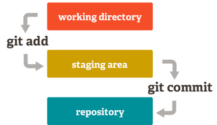

<h1>  Git Workshop

<p align="center"></p>

## Motivation

<p align="center"></p>

**What is Version Control?**

Version control system (VCS) is a software tool that helps the developers keep track of every modification to the code. If a mistake is made and things break down, developers can go back and compare earlier versions to debug and help fix the problem.

**Why use Version Control?**

Version control allow ease of collaboration  with other developers with different teams working on different features. Besides that, developing software without using version control is risky, like not having backups.

**What is Git?**

Git is a version control system created by Linus Torvalds in 2005 for development of the Linux kernel. Git is distributed, every directory on every computer has a working copy of the code with a complete history of changes and full version tracking capabilities. 

**Why use Git?**

Git is the best choice for developers. Here are the main reasons why:

*	Git is **fast** in terms of performance using highly efficient algorithms to track all changes.
*	Git is **secure** with all files, directories, versions, commits and tags secured with a cryptographically secure hashing algorithm called SHA1.
*	Git is **flexible** with developers requiring no network access, when ready they can `push` their changes with one command.
*	Git is **free** and an open-source project with thousands of developers maintaining it.
*	Git is the factory **standard**, it is by far the most widely used version control system today.

---

## Installation

Follow the instructions on [this](https://git-scm.com/book/en/v2/Getting-Started-Installing-Git) page to install `git`.

Try the following command:

```bash
$ git --version
```

If the installation is successful, you should see the version of the installed software.

```
git version 2.23.0
```

If something went wrong, you would see the following message instead:

```
command not found: git
```

<p align="center"></p>

---

## Configuration

<p align="center"></p>

#### `config`

To use `git` properly, you must set your name and email.

Use the `config` subcommand for this purpose.

```bash
$ git config --global user.name "[full name]"
$ git config --global user.email "[email address]"
```

>   #### Subcommand
>   
>   Some software are very complex and can have multiple use cases.
>   The use of subcommands allows developers to use these tools only for a particular task

To check the values with `config`

```bash
$ git config --list
```

Since we used the `--global` flag with our `config`, the same name and email will be used for any `git` repo we have on our system.

If you want to use a different name and email for a particular repo, use the `--local` flag instead

```bash
$ git config --local user.name "[full name]"
$ git config --local user.email "[email address]"
```

---

## Local Workflow

Create a directory

```bash
$ mkdir my-first-repo
$ cd my-first-repo
```

#### `init`

To initialize the repository, use the `init` subcommand.

```bash
$ git init
```


You have created a `git` repository on your local system. If you list **a**ll files

```bash
$ ls -la
```

>   #### Repository
>   
>   A repository is a directory that has elevated functionality.

You should see a **.git** directory. 

> #### `.git/`
>
> The .git directory contains everything that's related to our repository. If you send a .git directory to someone else, they would have the complete git project and it's full history. 
>
> If you ever want to stop tracking your project using git, you can just delete the .git directory.

### Logical Areas of a Git Repository

Git uses 3 logical areas to provide version control:



*	Working Tree

	Also called the working directory, this is what we see in our file system. When we add, delete, and edit files, we do that in the working tree.

*	Staging Area (Index)

	The staging area is where you prepare the set of changes you want to add to your repository. It is the set of files that git will keep ready for a commit. This area allows us to have full control over the files we put into our next commit. If we have multiple files, only the changes in the staging area are put into the next commit.

	>	The staging area is also known as index.

*	Repository

	This contains the commit history which allows us to access the previous versions of our project. The history is stored in the .git directory.

Create a file called `README.md`

```bash
$ touch README.md
```

> A **README** file contains information about your repository, directories and files. It is a form of documentation which is a guide to developers giving a description about your project and instructions on how to run the code. The `.md` stands for **m**ark**d**own file. Markdown is a markup language which is easy to use for formatting text.

With your preferred text editor, add the following content to the `README.md`

```
# My First Repo

Hello, world!
```

#### `status`

Use the `status` subcommand

```bash
$ git status
```

You will be provided with the following information.

```
On branch master

No commits yet

Untracked files:
  (use "git add <file>..." to include in what will be committed)

	README.md

nothing added to commit but untracked files present (use "git add" to track)
```

>   #### Branches
>   
>   Git can track file changes across multiple 'timelines' of a repository.
>   Each branch is its own universe. Git allows you to create branches from existing ones and move across them.
>	The default branch is called `master`.

<p align="center"></p>

>   #### Commits
>   
>   A commit is nothing but a checkpoint. It is a milestone in that timeline.
>
>	The `commit` command takes the staged changes and commits it to the project history.
>
>	When making commits use a clear and concise message describing the changes you have made.

`git` assigns `README.md` as _Untracked_ since it's a new file.
It will start tracking the file once we add it to the staging area.


In order to `commit` something, `git` needs to know exactly what to `commit`. In our case we want `git` to save the new file that we created, i.e. `README.md`. 

#### `add`

First let us add `README.md` to the staging area with the `add` subcommand

```bash
$ git add README.md
```

Check the `status` of the repository

```
$ git status
On branch master

No commits yet

Changes to be committed:
  (use "git rm --cached <file>..." to unstage)

	new file:   README.md
```

Earlier, our file was untracked. `git` has now added the file into the staging area, it expresses this by putting the `README.md` in _Changes to be committed_. After adding it to the staging area, `git` realizes that we are planning to commit this file.

#### `commit`

Confirm the changes with `commit` and a message by using the `-m` flag

```bash
$ git commit -m "Intial Commit" # the -m flag is for a message. A message usually describes what the commit has done.
```

Checking the status again

```bash
$ git status
On branch master
nothing to commit, working tree clean
```

_Nothing to commit_ means everything in the staging area has already been committed.

_Working tree clean_ means there is nothing new in our directory.

#### `log`

We can `log` the `commit` history

```bash
$ git log	# shows the most recent commit at the top
```
<!-- Feel free to remove this -->
You can notice the following:

*	40 hexadecimal character hash
*	Author name and email
*	Timestamp
*	The message we provided

Try to use the `-p` flag with `log`

```bash
$ git log -p	# shows what changed with each commit
```

---

## Remote Workflow

<p align="center"></p>

Our goal is to create a synced copy of our local repository on GitHub. This way, we can share our projects with the rest of the world. Just like how Instagram is meant for photos, [GitHub](https://github.com/) is meant for `git` repositories.

Either login or create an account and register with the email with which you set up your `config`. You can add your institute email address later to access the [GitHub Student Developer Pack](https://education.github.com/pack).

Once you have logged in, navigate to the top right corner and click the little **+** icon and click on **New repository**.

To setup your remote repository:

*   Give it a suitable name. In this case `my first repo` is apt.

    >   Git automatically converts the spaces to hyphens `-` in the name of your repository.

*   You can give it a description.
*   You can set it to private.
*   Since we have already created a `README.md` in our local repo, uncheck the `Initialize this repository with a README.md`

>   #### `.gitignore`
>   
>   It is a hidden file in your repository that tells git to ignore changes made to certain files.

>   #### License
>   
>   For repositories to be open source, a license is added to control the use, changes and distribution of the project.
>   For more information check out [this link](https://help.github.com/en/articles/licensing-a-repository).

<p align="center"></p>

We have created an empty repository on GitHub. Let us link this with our local repository.

Copy the link of the GitHub repository, it would look like this:

```
https://github.com/[your username]/my-first-repo.git
```

#### `remote`

Use the `remote` subcommand to add a `remote`

```bash
$ git remote add origin [url of your github repo]
```

>   #### Remotes
>   
>   A remote is essentially a duplicate of a repository in another location. You can have a remote on GitHub, GitLab, Google Drive, Dropbox, and even your own server.
>	If there are changes in the remote, you can download them locally. Similarly, if there are changes in the local repository, you can upload those changes in the remote.
> By convention, the name `origin` is given to the main remote. Due to this, you don't have to remember the entire url of your remote.

You can make sure the `remote` has been added

```bash
$ git remote	# displays all our remotes
origin
```

To see the full location of a `remote`, use the `-v` flag

```bash
$ git remote -v
```

You should see something like this:

```
origin  https://github.com/[your username]/[url of your github repo].git (fetch)
origin  https://github.com/[your username]/[url of your github repo].git (push)
```

`fetch` refers to the location from where git downloads the changes.
`push` refers to the location where git uploads the changes.

Right now, the local and remote repositories are linked. However, they are not synced yet.

Check the `commit` history

```bash
$ git log
```

>   #### `HEAD`
>
>   The HEAD is a special pointer that points to the local branch you are on. Since it usually points to a branch and not a commit, it is sometimes called a symbolic pointer. In this case, we are on the default branch or the master branch.
>
>   HEAD generally refers to the most recent commit on the current `branch`.
>
>   When HEAD is not pointing to the local branch and instead pointing directly to a commit, it is called a detached HEAD.

To sync the repositories, either:

*   the local repo pulls from the remote (local is behind)
*   the local repo pushes into the remote (local is ahead)

#### `push`

In our case, we need to perform a `push`

```bash
$ git push origin master # push the commits of the master branch to the remote named origin
```

If you refresh the page for your GitHub repository, you should see the changes in effect.

---

## Combining Local and Remote Workflows

Go ahead and add the following lines to the `README.md`

```
Follow [this link](./)

Using local workflow is simple:

*	Initialize the working directory
*	Modify your project
*	Add the files to the staging area
*	Commit your changes
```

#### `diff`

Often, we want to see the differences between the tracked files in the working directory and the staging area. You can see this using `diff`

```bash
$ git diff
```

If you want to see the differences between the files in the staging area and the most recent `commit`, use the `--staged` flag

```bash
$ git diff --staged		# shows what you are about to commit
```

Follow the steps to `commit` this change

*	Add the `README.md` file

	```bash
	$ git add README.md
	```

*	`commit` the changes

	```bash
	$ git commit -m "Added local workflow instructions"
	```

*	`push` the changes to the `remote`

	```bash
	$ git push origin master
	```

On refreshing the page on GitHub, the new link you added should point to the page itself.

Using the GUI, edit the `README.md` file of remote on GitHub and add the following lines

```
Using the remote workflow seems complicated, but is actually really easy:

*	Add remote as origin
*	Modify your project
*	Add the files to the staging area
*	Commit your changes
*	Push the changes onto the remote
```

#### `fetch`

To download changes made to the `remote` use the `fetch` subcommand

```bash
$ git fetch origin	# download changes from remote
$ git log
```

You can see the `HEAD` pointer is one commit behind the remote `origin/master`.

#### `merge`

`merge` these changes to your local master branch

```bash
$ git merge origin/master	# merge commit referenced by origin/master to local branch
```

#### `pull`

You can also use `pull` instead of `fetch`, the only difference is `pull` combines `fetch` and `merge` into a single command

```bash
$ git pull origin master	# fetch changes from origin and merge onto master branch
```

<p align="center"></p>


>	origin/master is a remote tracking branch, it tells us what the master branch looks like at our remote or origin.
>
>	If HEAD -> master and origin/master are pointing to the same commit, it means our local repository is in sync with the remote for the master branch.

Now that you know how to deal with any changes on the remote repository, you can start making your own changes.

Let's edit the `README.md` file again

```
We fetch the changes from remote and then merge them onto local.
```

Commit these changes and push, you can do this!

---

## Collaboration

<p align="center"></p>

You have seen the power of GitHub as a cloud storage platform for repositories. Now, let's build something together.

There are a few nuances associated with the process of collaborating on GitHub.

*   If the owner of a repository has added you as a collaborator, you can directly make changes to a repository.
*   If you are not a collaborator of the repository, you cannot make changes to it unless you create a fork of that repository and can later request the collaborators of the original repository to merge your changes.

>   #### Forks
>
>   A fork is a copy of a GitHub repository. When you fork a repository, you are the owner of that forked repository. A fork resides only within the context of GitHub.

>   #### Clones
>
>   A clone is a copy of a repository. Technically, any two repositories that are linked (via remote) are said to be clones. 

<p align="center"></p>

In our case, we created a clone of our local repository on the GitHub infrastructure.

Navigate to [acmbpdc/git-workshop](https://github.com/acmbpdc/git-workshop).

Create a fork of this repository. It will take a few seconds.

#### `clone`

Clone this the newly forked repository from GitHub and onto your local system. Use the `clone` subcommand to do this.

```bash
$ git clone [url of your github repo]
```

Sometimes, while making changes of your own, the original GitHub repository gets updated.

To sync changes from the original repository, add another remote.

```bash
$ git remote add upstream [url of original github repo]
```

We now have 2 remotes

```bash
$ git remote -v
```

The `remote upstream` is the original repo and the `remote origin` is your repo.

Now use `fetch` and `merge` to sync changes made to the original repo

*	To download changes made to the original

	```bash
	$ git fetch upstream	# download changes from original repo
	```

*	`merge` changes to local master `branch`

	```bash
	$ git merge upstream/master	# merge commit referenced by upstream/master to local branch
	```

To put these new changes from the original repo onto the forked repo

```bash
$ git push origin master
```

Branches allow you to work on different versions of the same file in parallel. Our edits on one branch can be independent of work on other branches. By now you know the default `branch` that is the `master branch`. Now we want to modify our project but we do not want to spoil our `master branch` and instead keep it clean. For this reason, we will create a new `branch`.

#### `branch`

Create a new `branch`

```bash
$ git branch feature
```

#### `checkout`

Move into this new `branch` using the `checkout` subcommand

```bash
$ git checkout feature
```

You can also both create and `checkout` a `branch` at once

```bash
$ git checkout -b feature
$ git log
```

You can see the `HEAD` pointer now pointing to the new `branch`.

To list the local branches

```bash
$ git branch	# display all local branches
* feature		# feature branch checked out
  master
```

By default `branch` alone does not list the `remote` branches. You can use `-a` flag to list **a**ll branches

```bash
$ git branch -a
* feature		# feature branch checked out
  master
  remotes/origin/HEAD -> origin/master
  remotes/origin/master
  remotes/upstream/master
```

To display **only** the `remote` branches, use the `-r` flag

```bash
$ git branch -r
  origin/HEAD -> origin/master
  origin/master
  upstream/master
```

Currently, we do not have a `remote branch` for feature, this is because the feature `branch` is not on the remote or on GitHub in our case.

Let's now update the `README.md`

```
To modify a repository for which you are not the owner:

*	Fork the repository
*	Add a remote upstream to the original repo to sync changes
*	Fetch and download the changes from original(upstream) and your(origin) repo
*	Merge and download the changes from original(upstream) and your(origin) repo
*	Modify the project
*	Push the changes onto remote(origin)
```

Commit the changes. Now we want to `push` on the feature branch

```bash
$ git push origin feature
```

You can see the changes on GitHub.

If you list the `remote` branches now

```bash
$ git branch -r
  origin/HEAD -> origin/master
  origin/feature
  origin/master
  upstream/master
```

You can now see the remote branch `origin/feature` has been added onto the list.

> #### Pull Requests
>
> A pull request is a request to the collaborators (owners) of a repository on GitHub to accept and hence pull changes made to the project b a 3rd party

<p align="center"></p>

In order to submit a pull request, it is best to merge these changes from your branch into the `master` branch of your fork.

You can see what changes will be made when you `merge` using `diff`

```bash
$ git diff master..feature
```

To merge a branch onto the current branch

```bash
$ git checkout master	# switches current branch to master branch
$ git merge feature		# merges changes of branch onto the current branch
$ git push origin master # push changes on master to GitHub Fork
```

Navigate to the page of your GitHub fork. You should now see an option to create a pull request. Essentially, you are requesting the original repository to pull your changes.

---

## Summary

We covered:

*	[Motivation](#motivation)
* [Installation](#installation)
* [Configuration](#configuration)
  * [`config`](#config)
  * [Subcommand](#subcommand)
* [Local Workflow](#local-workflow)
  * [`init`](#init)
  * [Repository](#repository)
  * [`.git/`](#.git)
  * [Logical Areas of a Git Repository](#logical-areas-of-a-git-repository)
  * [`status`](#status)
  * [Branches](#branches)
  * [Commits](#commits)
  * [`add`](#add)
  * [`commit`](#commit)
  * [`log`](#log)
* [Remote Workflow](#remote-workflow)
  * [`.gitignore`](#.gitignore)
  * [License](#license)
  * [`remote`](#remote)
  * [Remotes](#remotes)
  * [`HEAD`](#HEAD)
  * [`push`](#push)
* [Combining Local and Remote Workflows](#combining-local-and-remote-workflows)
  * [`diff`](#diff)
  * [`fetch`](#fetch)
  * [`merge`](#merge)
  * [`pull`](#pull)
* [Collaboration](#collaboration)
  * [Forks](#forks)
  * [Clones](#clones)
  * [`clone`](#clone)
  * [`branch`](#branch)
  * [`checkout`](#checkout)
  * [Pull Requests](#pull-requests)