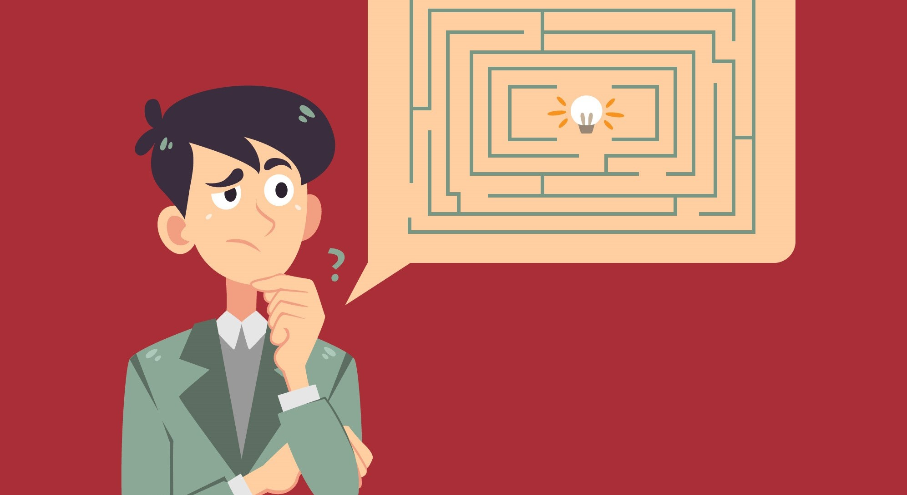
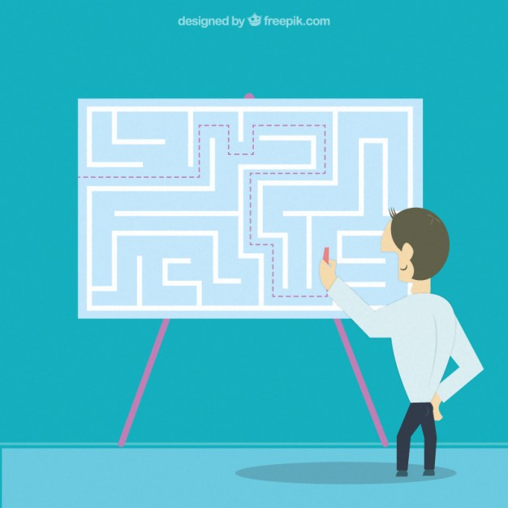
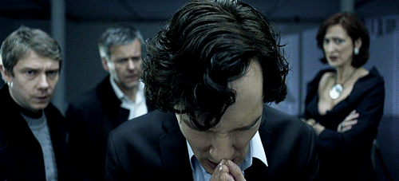
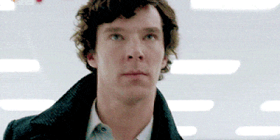
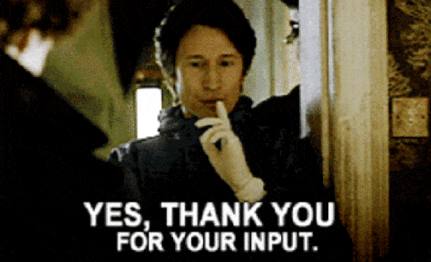
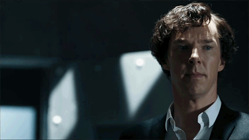
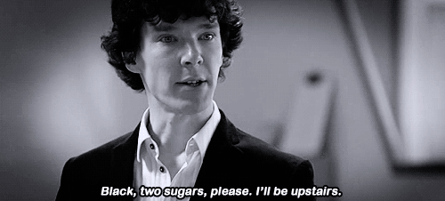
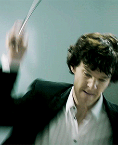
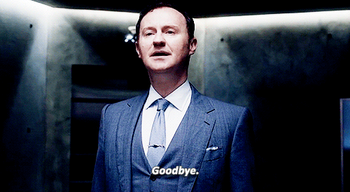

# Competitive Programming

>   "Talk is cheap. Show me the code"
>   - Linus Torvalds

Competitive programming has two main components:

*   **Design**

    <p align="center"></p>

    This requires problem-solving skills and involves mathematical thinking.
    The designed algorithm has to be correct and efficient.
    Theoretical knowledge of algorithms is important as a solution is typically a combination of well-known techniques and new insights.

*   **Implementation**

    <p align="center"></p>

    This requires good programming skills.
    Just knowing the idea of the solution is not enough; the implementation has to be precise.
    Typically, time is of the essence and writing the code should not take too long.

## Motivation

Competitive programming has many benefits:

*   Participating in competitions enhances problem-solving skills.
*   It prepares you well for technical interviews.
*   Not only will you learn about the fundamentals in algorithm design, you will also be familiar with their implementations.
*   You can make new friends when collaborating in a team of programmers
*   It is a fun sport!

<p align="center"></p>

## Time Complexity

The time complexity of an algorithm estimates how much time the algorithm will use for some input.
The efficiency of algorithms is important in competitive programming.

<p align="center"></p>

Generally, it is easy to design an algorithm that solves the problem slowly but it's challenging to write a fast algorithm.

By calculating the time complexity, we can check whether our algorithm is fast enough without actually implementing it.

The time complexity is often denoted in [Big O notation](https://en.wikipedia.org/wiki/Big_O_notation).

A program would have a time complexity of _O(...)_ where the 3 dots represent some function.
Usually, the variable _n_ denotes the input size.
For example, if the input is a `list` of numbers, _n_ will be the length of the `list`.

<p align="center"></p>

The following table shows some complexity classes in decreasing order of speed/efficiency:

|Complexity  | Description  |
|:-----------|:-------------|
|`O(1)`      |`constant`    |
|`O(long n)` |`logarithmic` |
|`O(n)`      |`linear`      |
|`O(n log n)`|`linearithmic`|
|`O(n²)`     |`quadratic`   |
|`O(n³)`     |`cubic`       |
|`O(2ⁿ)`     |`exponential` |
|`O(n!)`     |`factorial`   |


<p align="center"></p>

<p align="center"></p>

Most competitive programming websites that host competitions allow `10⁸` operations per second, while a few still allow `10⁷` operations.

| Input Size | Required Time Complexity |
|:----------:|:------------------------:|
| n ≤ 10    | O(n!) |
| n ≤ 20    | O(2ⁿ) |
| n ≤ 500   | O(n³) |
| n ≤ 5000	| O(n²) |
| n ≤ 10⁶	| O(n log n)
| n ≤ 10⁸	| O(n) |
| n is large | O(1) or O(log n) |

## Examples

<p align="center"></p>

Let us do a few examples.

### Problem 1 : Climbing Stairs

Read the [problem statement](https://leetcode.com/problems/climbing-stairs/).

<p align="center"></p>

#### Solution

```python
class Solution:
    def climbStairs(self, n: int) -> int:
        f0, f1 = 0, 1
        for i in range(n):
            f2 = f0 + f1
            f0 = f1
            f1 = f2
        return f2
```

### Problem 2 : 2Sum

Read the [problem statement](https://leetcode.com/problems/two-sum/).

#### Bad Solution


This is a brute force approach

```python
def twoSum(self, nums: List[int], target: int) -> List[int]:
    for i in range(len(nums) - 1):
        for j in range(i + 1, len(nums)):
            if (nums[i] + nums[j] == target):
                return [i, j]
```

<p align="center"></p>

#### Better Solution

This solution sorts the list first

```python
def twoSum(self, nums: List[int], target: int) -> List[int]:
    for i in range(len(nums)):
        nums[i] = [nums[i], i]
    nums.sort()
    low = 0
    high = len(nums) - 1
    while low < high:
        sum = nums[low][0] + nums[high][0]
        if sum == target:
            return [nums[low][1], nums[high][1]]
        elif sum < target:
            low += 1
        else:
            high -= 1
```

#### Best Solution

This solution uses a dictionary

```python
def twoSum(self, nums: List[int], target: int) -> List[int]:
    map = dict()
    for i in range(len(nums)):
        complement = target - nums[i] 
        if complement in map:
            return [i, map[complement]]
        else:
            map[nums[i]] = i
```

[3Sum](https://leetcode.com/problems/3sum/) is a variation to this problem.

### Problem 3 : Majority Element

Read the [problem statement](https://leetcode.com/problems/majority-element/).

#### Bad Solution

This approach first sorts the list

```python
class Solution:
    def majorityElement(self, nums: List[int]) -> int:
        nums.sort()
        return nums[len(nums) // 2]
```

#### Better Solution

This approach uses a dictionary.

```python
class Solution:
    def majorityElement(self, nums: List[int]) -> int:
        map = dict()

        for num in nums:
            map[num] = map.get(num, 0) + 1
            if map[num] > len(nums) / 2:
                return num
```

#### Best Solution

This approach is based on the [Boyer-Moore Algorithm](https://en.wikipedia.org/wiki/Boyer%E2%80%93Moore_string-search_algorithm)

```python
def majorityElement(self, nums: List[int]) -> int:
    counter = 0

    for num in nums:
        if counter == 0:
            m = num
        if m == num:
            counter += 1
        else:
            counter -= 1
    
    return m
```

<p align="center"></p>

[Majority Element II](https://leetcode.com/problems/majority-element-ii/) is a variation to this problem.

### Problem 4 : Longest Substring Without Repeating Characters

Read the [problem statement](https://leetcode.com/problems/longest-substring-without-repeating-characters/).

#### Solution

```python
def lengthOfLongestSubstring(self, s: str) -> int:
    map = dict()
    length = low = high = 0

    for i in range(len(s)):
        char = s[i]
        if char in map:
            low = max(map[char] + 1, low)
        map[char] = i
        length = max(high - low + 1, length)
        high += 1
    
    return length
```

## Practice

<p align="center"></p>

There are plenty of platforms for you to practice:

*   [HackerRank](https://hackerrank.com)
*   [CodeForces](http://codeforces.com)
*   [SPOJ](https://www.spoj.com/)
*   [LeetCode](http://leetcode.com)
*   [CodeChef](http://codechef.com)
*   [TopCoder](https://www.topcoder.com/)
*   [HackerEarth](https://www.hackerearth.com/)

## Summary

We covered:

*   [Motivation](#motivation)
*   [Time Complexity](#time-complexity)
*   [Examples](#examples)
    *   [Climbing Stairs](#problem-1--climbing-stairs)
    *   [2Sum](#problem-2--2sum)
    *	[Majority Element](#problem-3--majority-element)
    *	[Longest Substring Without Repeating Characters](#problem-4--longest-substring-without-repeating-characters)
*   [Practice](#practice)

<p align="center"></p>
