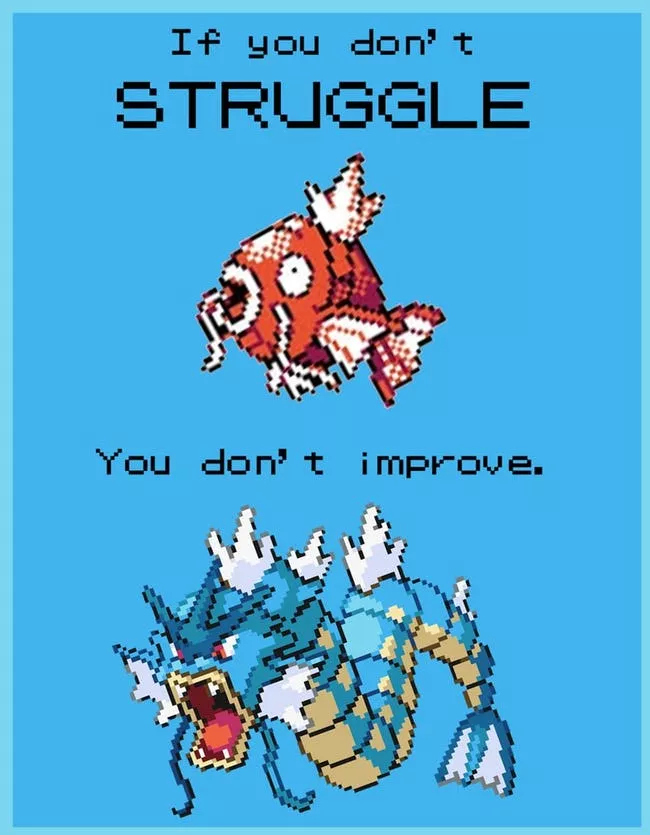
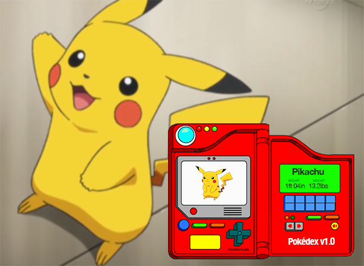

# Introductory Web Development

> Web development is the work involved in developing a web site for the Internet (World Wide Web) or an intranet (a private network).
> - Wikipedia

Web development has evolved over time. The tools are constantly evolving. Fortunately, the core technology has been consistent.

<p align="center"></p>

---

## Disclaimer

It is recommended to use a text editor like :

*   [Visual Studio Code](https://code.visualstudio.com/)
*   [Atom](https://atom.io/) or
*   [Sublime Text](https://www.sublimetext.com/)

for the purpose of this session. Such text editors provide an easy workflow and hence are the industry standard tools.

---

## Motivation

<p align="center"></p>

*   Ever since the commercialization of the internet, web development has been a growing industry with newer technologies always on the rise.
*   This ever-growing set of tools and technologies have helped developers build more dynamic and interactive websites.
*   Web developers now help to deliver applications as web services which were traditionally only available as applications on a desk-based computer.
*   This has allowed for many opportunities to decentralize information and media distribution.

---

## Basics

A website is just a special set of documents that is hosted on a server whose address is specified as a [URL](https://en.wikipedia.org/wiki/URL).

>   #### Host
>
>   A host is just a server; a computer.

A website comprises of web pages

>   #### Page
>
>   A web page is document present on the server, which can be displayed in a desired format by a browser

A web page is rendered by a browser based on 3 main components:

*   **HTML**

    *HyperText Markup Language* defines the *content* of the page.
*   **CSS**

    **Cascading Style Sheets** affect the *styles* of the content in the page.

*   **JS**

    *JavaScript* allows for *dynamic* behaviors of a web page

All websites can be broken down into these 3 key components.

<p align="center"></p>

---

## Setup

Create a new directory for the project

```bash
mkdir my-first-website && cd my-first-website
```

The Python standard library has a module that can host a web server. Run the following command to set it up.

```bash
python3 -m http.server
```

This starts a local web server on [`0.0.0.0:8000`](http://0.0.0.0:8000).

<p align="center"></p>

As mentioned previously, a web site contains web pages.

Whenever a browser requests for a website by its URL, the server sends a page by default. This page is the `index` page.

Create `index.html` and fill in the following content.

```html
<html lang="en">
<head>
    <meta charset="UTF-8">
    <meta name="viewport" content="width=device-width, initial-scale=1.0">
    <meta http-equiv="X-UA-Compatible" content="ie=edge">
    <title>My Website</title>
</head>
<body>
    Hello, World!
</body>
</html>
```

Navigate to the address of your local web server. You should see the web page rendered by your browser.

---

## Content

<p align="center"></p>

HTML has many tags that have different behavior.

*   `html` is the root tag
*   `head` defines `metadata` and `references` to other documents
*   `title` specifies the title of the page
*   `body` defines the content of the page

Within the `body` tag, input the following content. You can edit the information inside the tags.

```html
<h1 id="name">Your Name</h1>

<p>A short description about yourself. </p>

<ul>
    <li>How old are you?</li>
    <li>Where are you studying?</li>
    <li>What do you like to do? </li>
</ul>

<p></p>
```

>   #### Headings
>
>   The `h1`, `h2`, `h3`, `h4`, `h5` and `h6` tags are meant for headings.

Try setting the contents of the `h1` tag to your name. You can also try changing the tag from `h1` to some other header tag.

```html
<h1 id="name">Your Name</h1>
```

>   #### Paragraphs
>
>   The `p` tag is used for paragraphs.


>   #### Lists
>
>   The `ul` and `ol` tags represent unordered and ordered lists.
>   They can contain `li` tags, which are list items

>   #### Images
>
>   The `img` tag represents videos.
>   The `src` attribute holds the URL of the image to be rendered

If you want to put an image of your choice that is on your local system:

*   Create a directory `assets/img`
*   Copy the image into the `assets/img` directory
*   Change the `src` attribute to the relative path of the image. If your image is `image.jpg`, change `src` to `assets/img/image.jpg`

<p align="center"></p>

---

Let us create another page, `contact.html`. Fill it with the following content.

```html
<html lang="en">
<head>
    <meta charset="UTF-8">
    <meta name="viewport" content="width=device-width, initial-scale=1.0">
    <meta http-equiv="X-UA-Compatible" content="ie=edge">
    <title>Contact</title>
</head>
<body>
    <h1 id="contact">Contact</h1>

    <ul>
        <li>Phone : +971 52 123 4567</li>
        <li>BITS Pilani, Dubai Campus, DIAC, Dubai, UAE</li>
    </ul>

    <h1 id="socials">Socials</h1>
    <ul>
        <li><a href="">Mail</a></li>
        <li><a href="">Instagram</a></li>
        <li><a href="">GitHub</a></li>
    </ul>
</body>
</html>
```

<p align="center"></p>

You can view this page through the browser by navigating to [`0.0.0.0:8000/contact.html`](http://0.0.0.0:8000/contact.html)

>   #### Links
>
>   The `a` or anchor tag renders hyper text links.
>   The `href` attribute holds the URL of the resource to be linked.
>   This could be anything. A file. A webpage. Anything.

You can list your contact information here.

>   #### Generators
>
>   Creating *HTML* pages from scratch can be very time consuming.
>   These [**static-site generators**](#static-site-generators) create these pages from a template.
>
>   Try them out. If you plan on building static sites, choose one that uses a language you are familiar with.

<p align="center"></p>

---

## Styling

Right now the site looks very bad. Let us add some styles.

To style the content of a web page, the browser uses CSS. There are a lot of frameworks that have CSS templates available. We will be using [Bootstrap](https://getbootstrap.com) to style our content.

<p align="center"></p>

Add the following tag to the `head` tags in all your files.

```html
    <link rel="stylesheet" href="https://maxcdn.bootstrapcdn.com/bootstrap/4.0.0/css/bootstrap.min.css" integrity="sha384-Gn5384xqQ1aoWXA+058RXPxPg6fy4IWvTNh0E263XmFcJlSAwiGgFAW/dAiS6JXm" crossorigin="anonymous">

```

Lets put all the content in the `body` tag into a `div`.

To customize these styles:

*   Create a directory `assets/css`
*   Create a file `style.css` with the following content:

    ```css
    body {
        background: rgb(241, 248, 255);
        color: #333333;
        margin-top: 5rem;
    }

    h1, h2, h3, h4, h5, h6 {
        color: #333333;
    }

    p, li {
        color: #4C5454;
    }

    ul {
        margin: 0;
    }

    .bg-steel {
        background-color: #005796;
    }

    .site-header .navbar-nav .nav-link {
        color:rgb(241, 248, 255);
    }

    .site-header .navbar-nav .nav-link:hover {
        color:rgb(241, 248, 255);
    }

    .site-header .navbar-nav .nav-link.active {
        font-weight: 500;
    }
    ```
*   Add the following tag to the `head` tags in all HTML files.

    ```html
    <link rel="stylesheet" type="text/css" href="assets/css/style.css">
    ```

To navigate between webpages, most websites have a `navbar`. Bootstrap has some templates that we can try.

Add the following to the `body` tags of all the HTML files

```html
<header class="site-header">
    <nav class="navbar navbar-expand-md navbar-dark bg-steel fixed-top">
        <div class="container">
            <a class="navbar-brand mr-4" href="/">Home</a>
            <div class="navbar-nav">
                <a class="nav-item nav-link" href="/contact.html">Contact</a>
            </div>
        </div>
    </nav>
</header>
```

<p align="center"></p>

You can mess around with the styles till you are satisfied with your layout.

Now, your web pages should look similar to these:

*   `index.html`:

    ```html
    <html lang="en">
    <head>
        <meta charset="UTF-8">
        <meta name="viewport" content="width=device-width, initial-scale=1.0">
        <meta http-equiv="X-UA-Compatible" content="ie=edge">
        <title>Kelvin DeCosta's Site</title>
        <link rel="stylesheet" href="https://maxcdn.bootstrapcdn.com/bootstrap/4.0.0/css/bootstrap.min.css" integrity="sha384-Gn5384xqQ1aoWXA+058RXPxPg6fy4IWvTNh0E263XmFcJlSAwiGgFAW/dAiS6JXm" crossorigin="anonymous">
        <link rel="stylesheet" type="text/css" href="assets/css/style.css">
    </head>
    <body>
        <header class="site-header">
            <nav class="navbar navbar-expand-md navbar-dark bg-steel fixed-top">
                <div class="container">
                    <a class="navbar-brand mr-4" href="/">Home</a>
                    <div class="navbar-nav">
                        <a class="nav-item nav-link" href="/contact.html">Contact</a>
                    </div>
                </div>
            </nav>
        </header>
        <div class="container">
            <h1 id="name">Kelvin DeCosta</h1>

            <p>Hello! I am who I am.</p>

            <ul>
                <li>I am 21 years old</li>
                <li>I am studying Computer Science at BITS Pilani, Dubai</li>
                <li>I like to help others code!</li>
            </ul>

            <p></p>
        </div>
        </body>
    </html>
    ```

*   `contact.html`:

    ```html
    <html lang="en">
    <head>
        <meta charset="UTF-8">
        <meta name="viewport" content="width=device-width, initial-scale=1.0">
        <meta http-equiv="X-UA-Compatible" content="ie=edge">
        <title>Contact</title>
        <link rel="stylesheet" href="https://maxcdn.bootstrapcdn.com/bootstrap/4.0.0/css/bootstrap.min.css" integrity="sha384-Gn5384xqQ1aoWXA+058RXPxPg6fy4IWvTNh0E263XmFcJlSAwiGgFAW/dAiS6JXm" crossorigin="anonymous">
        <link rel="stylesheet" type="text/css" href="assets/css/style.css">

    </head>
    <body>
        <header class="site-header">
            <nav class="navbar navbar-expand-md navbar-dark bg-steel fixed-top">
                <div class="container">
                    <a class="navbar-brand mr-4" href="/">Home</a>
                    <div class="navbar-nav">
                        <a class="nav-item nav-link" href="/contact.html">Contact</a>
                    </div>
                </div>
            </nav>
        </header>
        <div class="container">
            <h1 id="contact">Contact</h1>

            <ul>
                <li>Phone : +971 52 123 4567</li>
                <li>BITS Pilani, Dubai Campus, DIAC, Dubai, UAE</li>
            </ul>

            <h1 id="socials">Socials</h1>
            <ul>
                <li><a href="mailto:decsotakelvin@gmail.com">Mail</a></li>
                <li><a href="https://instagram.com/kelvin_decosta">Instagram</a></li>
                <li><a href="https://github.com/kelvindecosta">GitHub</a></li>
            </ul>
        </div>
    </body>
    </html>
    ```

>   #### CSS Derivatives
>
>   [Sass](https://sass-lang.com/) is a derivative of CSS that has additional features.

---

## Deployment

<p align="center"></p>

Host your website on GitHub. It is free. It is easy.

*   Create a git repo.

    ```bash
    git init
    ```

    Commit everything on the working directory.

    ```bash
    git add .
    git commit -m "Initial Commit"
    ```
*   Navigate to GitHub and create a new repository. Make sure to uncheck "Add a README". Copy the URL of this GitHub repo, so that we can link it with our local repo.
*   Link the GitHub repo with our local repo

    ```bash
    git remote add origin https://github.com/username/githubrepo.git
    ```

    Push everything to the GitHub repo

    ```bash
    git push origin master
    ```
*   Navigate to the `Settings` tab on the GitHub repo.

    Under the `GitHub Pages` section, set the `Source` to `master branch`

    Wait for a few seconds.

    Your site will be published on `https://username.github.io/githubrepo/`
*   You can make changes to your local repository, commit them, push them to the GitHub repo and those changes will be reflected on this URL.

<p align="center"></p>

---

## Dynamism

We can make our static pages dynamic with some JavaScript.

<p align="center"></p>

Let us add some functionality that changes the image on click.

*   Create a directory `assets/js`
*   Create a file `script.js` with the following content:

    ```js
    var main = "https://avatars1.githubusercontent.com/u/38982451?s=460&v=4";
    var other = "https://66.media.tumblr.com/35d3a02f4691f8c2c75fbc4ef3365988/tumblr_p1ja1iqXyS1wkxnj3o9_1280.png";

    function changeImage() {
        if (document.getElementById("profile").src == other) {
            document.getElementById("profile").src = main;
        } else {
            document.getElementById("profile").src = other;
        }
    }
    ```
*   Link the script by adding the following to the `index.html` `head` tag:

    ```html
    <script type="text/javascript" src="assets/js/script.js" ></script>
    ```
*   Add a `onclick` attribute to the `#profile` `img` and set it to `changeImage()`

Test it out.

## Discover

This session was meant to introduce you to the basic technologies behind websites. In practice, these solutions are very naive.

<p align="center"></p>

There are a lot of different frameworks that can build powerful and scalable websites. Although, these frameworks are out of the scope of this bootcamp, they provide better workflows once you get the hang of them.

Here are a few popular frameworks.

#### Static Site Generators

*   [Gatsby](https://www.gatsbyjs.org/)
*   [Jekyll](https://jekyllrb.com/)
*   [Pelican](https://blog.getpelican.com/)
*   [Hugo](https://gohugo.io/)

#### CSS Frameworks

*   [Bootstrap](https://getbootstrap.com/)
*   [Semantic UI](https://semantic-ui.com/)
*   [Foundation](https://foundation.zurb.com/)

#### Front End Frameworks

*   [React](https://reactjs.org/)
*   [Vue](https://vuejs.org/)
*   [Angular](https://angular.io/)

#### Server Side Languages

*   [Node](https://nodejs.org/en/)
*   [Python](https://www.python.org/)
*   [PHP](https://www.php.net/)
*   [C#](https://docs.microsoft.com/en-us/dotnet/csharp/)
*   [Go](https://golang.org/)

For a step by step guide on becoming a web developer, check out [this video](https://www.youtube.com/watch?v=UnTQVlqmDQ0) by [Brad Traversy](https://www.youtube.com/channel/UC29ju8bIPH5as8OGnQzwJyA) in which he showcases advance technologies that are the current industry standards.

## Summary

We covered:

*   [Motivation](#motivation)
*   [Basics](#basics)
    *   [Host](#host)
    *   [Page](#page)
*   [Setup](#setup)
*   [Content](#content)
    *   [Headings](#headings)
    *   [Paragraphs](#paragraphs)
    *   [Lists](#lists)
    *   [Images](#images)
    *   [Links](#links)
    *   [Generators](#generators)
*   [Styling](#styling)
    *   [CSS Derivatives](#css-derivatives)
*   [Deployment](#deployment)
*   [Dynamism](#dynamism)
*   [Discover](#discover)
    *   [Static Site Generators](#static-site-generators)
    *   [CSS Frameworks](#css-frameworks)
    *   [Front End Frameworks](#front-end-frameworks)
    *   [Server Side Languages](#server-side-languages)
